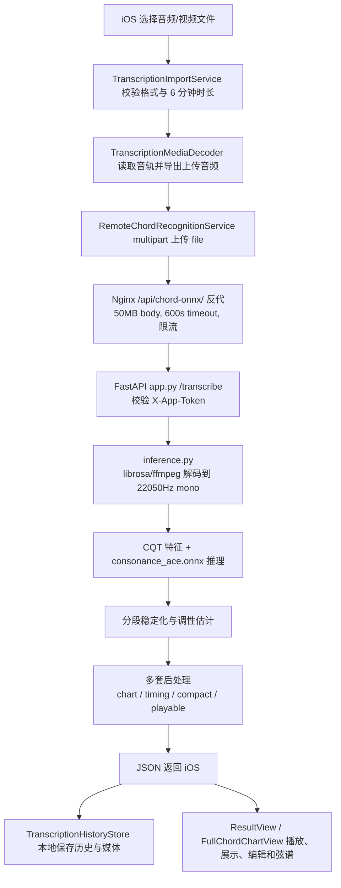

# AGENTS.md

## 项目概览

Guitar AI Coach（吉他 AI 教练 / Wanle Guitar）是一个吉他学习产品，仓库同时包含：

- Web：`frontend/`，Vue 3 + Vite + TypeScript SPA。
- Backend：`backend/code/`，纯 Python stdlib HTTP 服务，无 Web 框架。
- Native iOS：`swift_app/` Swift Package + `swift_ios_host/` Xcode 宿主工程。
- 部署：`deploy/`，ECS、Nginx、systemd、PaddleOCR / ONNX 辅助服务配置。

以后接手时优先判断需求属于 Web、Backend 还是 iOS。当前主要产品形态偏 iOS；Swift 相关功能通常要在 `swift_app/` 和 `swift_ios_host/` 之间分清职责。

## 目录结构与职责

### `frontend/`

Vue 3 + Vite 前端，入口在 `frontend/src/`。

- `src/views/`：主要页面。
- `src/components/`：通用 Vue 组件，例如和弦图。
- `src/router.ts`：路由。
- `src/session.ts`：会话/API 地址相关逻辑。
- 音频相关：`chordAudioLazy.ts`、`playChordFromFrets.ts`、`guitarAcousticSlimSampler.ts`。

运行与检查：

```bash
cd frontend
npm ci
npm run dev -- --host 0.0.0.0
npx tsc --noEmit
npm run build
```

Vite dev server 默认端口 `5173`。前端没有 Vite proxy，接口直接请求后端；生产环境由 Nginx 处理 `/api/` 反代。

### `backend/code/`

Python 后端是 stdlib HTTP 服务，主入口是 `backend/code/index.py`。没有 Flask/FastAPI/Django。

常见模块定位：

- `index.py`：HTTP 入口、核心 chords API、路由分发。
- `chord_transpose.py`：和弦变调逻辑。
- `chord_explain_db.py`：和弦解释缓存。
- `quiz_db.py`：和弦题库训练。
- `ear_db.py`、`init_ear_seed.py`：练耳训练。
- `song_chords_db.py`：找歌和弦。
- `sheets_http.py`、`sheets_db.py`、`sheets_storage.py`：用户曲谱上传/存储。
- `practice_http.py`、`practice_db.py`：练习记录 API 和 MySQL 存储。
- `auth_apple.py`、`auth_db.py`、`auth_jwt.py`、`auth_ci.py`：Apple 登录/JWT/认证相关。
- `mysql_crud_sample.py`：MySQL 连接与样例。

运行与检查：

```bash
cd backend/code
BACKEND_HOST=0.0.0.0 python3 index.py
python3 -c "import index"
```

默认监听 `127.0.0.1:18080`；云环境或浏览器访问时用 `BACKEND_HOST=0.0.0.0`。依赖主要是 `PyMySQL`。MySQL 未配置时，部分需要数据库的接口会返回 503，这是预期行为。`DASHSCOPE_API_KEY` 缺失时 AI 生成/解释类接口不可用。

### `backend/chord_onnx_server/`

扒歌/音频转和弦的后端服务，独立于 `backend/code/index.py` 主后端。这里是 FastAPI + ONNX Runtime 服务，线上由 Nginx 将 `/api/chord-onnx/` 反代到 ECS 本机 `127.0.0.1:8000`。

整体链路：



核心文件：

- `app.py`：FastAPI 入口，提供 `GET /health` 和 `POST /transcribe`。
- `inference.py`：音频解码、CQT 特征、ONNX 推理、分段识别。
- `models/consonance_ace.onnx`：当前和弦识别模型。
- `chord_chart_postprocess.py`：生成用户可读的和弦谱段落。
- `timing_segment_postprocess.py`：踩点优先边界后处理。
- `timing_compact_postprocess.py`：更紧凑的边界/段落压缩。
- `playable_compact_postprocess.py`：面向可弹唱谱的精简和弦段。
- `chord_auth.py`：`X-App-Token` / `CHORD_ONNX_APP_TOKEN` 校验。
- `transcribe_batch.py`、`run_eval_set.py`、`eval_metrics.py`：本地批量评估与回归检查。
- `uploads/`、`outputs/`：服务运行时保存上传音频和 JSON 输出，通常不应作为业务源代码依赖。

服务实现要点：

- 服务入口是 `app.py`，FastAPI 只负责鉴权、接收文件、调用 `ChordOnnxInferenceService.transcribe()`、记录耗时和落一份 `outputs/<request_id>.json`。
- 鉴权是轻量 App Token：服务端从 `CHORD_ONNX_APP_TOKEN` 读配置，客户端在 `X-App-Token` 请求头传入。未配置返回 503，token 不匹配返回 401。
- 上传文件限制：只收 `.wav`、`.mp3`、`.m4a`，服务端最大 50MB；Nginx 同样配置 `client_max_body_size 50m`。
- 音频解码优先 `librosa.load(..., sr=22050, mono=True)`；失败时走 ffmpeg 转临时 WAV 后再读，所以 ECS 上必须有 ffmpeg。
- 推理输入是 CQT 特征，核心常量在 `inference.py`：`TARGET_SR = 22050`、`HOP_LENGTH = 512`、20 秒 chunk 分块。
- ONNX Runtime 使用 CPU provider，模型路径固定为 `models/consonance_ace.onnx`。
- 推理输出先转成 raw `segments`，再经过稳定化、短片段吸收、调性估计和多套后处理，最终给 iOS 多种时间轴选择。

返回字段与用途：

- `duration`：音频总时长秒数。
- `key`：估计调性。
- `segments`：模型/基础稳定化后的原始识别段，主要用于调试。
- `displaySegments`：播放页时间轴使用的展示段。
- `simplifiedDisplaySegments`：简化和弦名后的播放展示段。
- `chordChartSegments`：完整和弦谱页使用的谱面段。
- `timingVariants`：A/B 调试和产品选择用的边界版本，包括 `normal`、`noAbsorb`、`timing`、`timingCompact`、`playableCompact`。
- `timingVariantStats`：各版本段数、压缩数、吸收数等统计，排查“谱太碎/太粗”时先看这里。
- `debug`：模型输入输出形状、chunk、后处理诊断等服务端调试信息。
- `timing`：服务端 receive/ingest/inference/total 耗时，iOS DEBUG 日志也会打印客户端上传耗时。

后处理分工：

- `chord_chart_postprocess.py`：把 raw/简化时间轴整理成适合整首谱展示的段落；会合并相邻相同和弦、吸收短暂经过和弦、简化复杂和弦名。
- `timing_segment_postprocess.py`：偏“踩点优先”的边界处理，关注 onset/chroma/beat 边界，减少不自然切点。
- `timing_compact_postprocess.py`：进一步压缩碎片段，保留必要转折，适合更清爽的谱面。
- `playable_compact_postprocess.py`：面向实际弹唱，把复杂/装饰性和弦进一步转成更容易弹的版本。

### iOS 扒歌/转录实现

iOS 侧在 `swift_ios_host/Sources/Transcription/`：

- `TranscriptionHomeView.swift`：导入入口、历史入口、购买状态入口。
- `TranscriptionImportService.swift`：支持格式和 6 分钟时长校验。当前支持 `mp3`、`m4a`、`wav`、`aac`、`mp4`、`mov`。
- `TranscriptionMediaDecoder.swift`：用 AVFoundation 读取音轨、探测时长、导出上传音频/波形所需数据。
- `TranscriptionEngine.swift`：包含本地模拟合并逻辑和远程 `RemoteChordRecognitionService`；线上 endpoint 固定为 `https://wanghanai.xyz/api/chord-onnx/transcribe`。
- `TranscriptionProcessingView.swift`：准备、上传、分析、生成谱的进度 UI。
- `TranscriptionHistoryStore.swift`：本地保存历史 JSON 和媒体文件，媒体在 Documents 下的 `transcription_media/`。
- `TranscriptionResultView.swift`：播放页，按返回段落高亮当前和弦。
- `FullChordChartView.swift`：完整和弦谱页，支持编辑、删除、合并、保存编辑后的谱面段。
- `PurchaseManager.swift` / `PurchaseView.swift`：扒歌功能购买/权限入口。

iOS 上传实现细节：

- `RemoteChordRecognitionService.transcribeAudio()` 会构造 multipart body 到临时文件，再用 `URLSession.uploadTask(fromFile:)` 上传，便于拿真实进度。
- 请求头 `X-App-Token` 来自 `AppSecrets.chordOnnxAppToken`，对应 Xcode Build Setting `CHORD_ONNX_APP_TOKEN`。
- 客户端超时为 600 秒，和 Nginx `proxy_read_timeout 600s` 对齐。
- `GET /api/chord-onnx/health` 用于首次进入页面预检网络访问和服务可用性。
- 远端返回 401 映射为 unauthorized，503 映射为 serviceUnavailable，其余非 2xx 映射为 HTTP 错误。

接口行为：

- `POST /transcribe` 接收 multipart `file`，支持 `.wav`、`.mp3`、`.m4a`，最大 50MB。
- 请求必须带 `X-App-Token`，值来自服务端环境变量 `CHORD_ONNX_APP_TOKEN`；iOS 构建也需要注入同一个 token。
- 返回 `segments`、`displaySegments`、`simplifiedDisplaySegments`、`chordChartSegments`、`timingVariants`、`timingVariantStats` 等，iOS 扒歌页会直接消费这些字段。

运行与部署：

```bash
cd backend/chord_onnx_server
./run.sh
```

线上部署脚本是 `deploy/ecs/chord_onnx/push-and-setup.sh`，会 rsync 该目录、进入 `chord-onnx` conda 环境、安装依赖并启动 uvicorn。日志默认在 ECS 的 `~/guitar-ai-coach/logs/chord_onnx.log`。不要把远端模型或运行时输出误删，脚本故意没有用 `rsync --delete`。

常用排障入口：

- 线上健康检查：`curl https://wanghanai.xyz/api/chord-onnx/health`
- ECS 日志：`tail -f ~/guitar-ai-coach/logs/chord_onnx.log`
- 单文件本地批量请求：`cd backend/chord_onnx_server && python transcribe_batch.py path/to/audio.m4a`
- 固定评估集：`cd backend/chord_onnx_server && python run_eval_set.py`
- 后处理单测：`cd backend/chord_onnx_server && python -m unittest discover tests`
- 如果 iOS 上传被拒，先查 `CHORD_ONNX_APP_TOKEN` 是否同时存在于 ECS `deploy/ecs/backend.env` 和 iOS Build Setting。
- 如果音频格式失败，先查 ECS 是否有 ffmpeg、文件是否超过 50MB、扩展名是否在服务端允许列表。

### `backend/database/`

数据库脚本目录。

- `ddl/`：历史基线和手工 DDL，例如 chord cache、quiz、ear、song chords。
- `flyway/sql/`：新增迁移，当前包括 Apple 用户、用户曲谱、练习记录、视唱等。
- 原则：运行时代码不自动建表；上线前用 DDL/Flyway 准备 schema。

### `swift_app/`

Swift Package，定义可复用的 iOS 功能库和模块。`Package.swift` 暴露这些 product：

- `Core`：网络、共享工具、资源。
- `Tuner`：调音器。
- `Fretboard`：指板。
- `Chords`：和弦查询/指法。
- `ChordChart`：和弦谱/图表。
- `Ear`：练耳。
- `Practice`：练习工具与题卡。
- `Metronome`：节拍器。
- `Profile`：个人/设置相关。
- `App`：Swift Package 里的可执行壳。

一般规则：跨宿主复用、纯功能模块、领域逻辑优先放这里。

### `swift_ios_host/`

Xcode 宿主工程，面向真实 iOS App。`project.yml` 由 XcodeGen 管理，工程文件是 `SwiftEarHost.xcodeproj`。

主要目录：

- `Sources/App/`：App 入口、Tab、导航壳。
- `Sources/Practice/`：宿主侧练习首页、练习记录本地 store、练习页桥接。
- `Sources/Sheets/`：我的谱，本地曲谱导入、列表、阅读器、解析数据。
- `Sources/Transcription/`：扒歌/音频转和弦相关 UI、服务、购买逻辑。
- `Sources/Resources/Localization/Localizable.xcstrings`：多语言文案。
- `Tests/`、`UITests/`：宿主工程测试。

一般规则：与 iOS App 生命周期、本地存储、相册、导航、购买、宿主 UI 强相关的内容放这里。比如“我的谱”列表、iOS 本地练习记录显示，应改 `swift_ios_host/Sources/Sheets` 与 `swift_ios_host/Sources/Practice`，不要牵到后端。

常用命令：

```bash
xcodebuild -project swift_ios_host/SwiftEarHost.xcodeproj -scheme SwiftEarHost -destination 'generic/platform=iOS Simulator' build
xcodebuild -project swift_ios_host/SwiftEarHost.xcodeproj -scheme SwiftEarHost -destination 'generic/platform=iOS Simulator' build-for-testing
```

如果改了 `project.yml`，需要用 XcodeGen 重新生成工程。iOS 构建需要本机 Xcode；无 Xcode 的 Cloud VM 不适合跑 Swift iOS 构建。

### 其他目录

- `appstore_screenshots/`：App Store 截图产物。
- `docs/`：项目文档与调研资料。
- `requirements/`：需求和题库/建表草案。
- `scripts/`：模型导出等辅助脚本。
- `benchmarks/`：基准测试。
- `privacy-policy-pages/`、`site/`：静态站点/隐私页相关。

## 云服务器与部署摘要

详细步骤见 `deploy/ecs/README.md`，这里保留快速定位信息。

- ECS 公网 IP：`47.110.78.65`
- SSH 用户：`wanghan`
- 服务器项目路径：`/home/wanghan/guitar-ai-coach`
- 静态站点目录：`/home/wanghan/guitar-ai-coach/site`
- 后端目录：`/home/wanghan/guitar-ai-coach/backend/code`
- 后端环境文件：`/home/wanghan/guitar-ai-coach/deploy/ecs/backend.env`
- systemd 服务：`guitar-ai-coach-backend`
- 后端监听：`127.0.0.1:18080`
- Nginx 站点配置：服务器 `${ECS_PATH}/deploy/ecs/nginx/guitar-server.conf`
- 仓库 Nginx 主配置副本：`deploy/nginx-ecs/nginx/nginx.conf`
- 线上域名/HTTPS 见 `deploy/ecs/README.md`，证书默认按 acme.sh 方案维护。

不要把 SSH 私钥、`backend.env` 里的 API Key、证书私钥提交到 Git。`deploy/ecs/backend.env` 如果在本地存在，提交前必须确认没有敏感值。

常见发布动作：

```bash
# 前端
cd frontend && npm run build
rsync -avz frontend/dist/ "$ECS_USER@$ECS_HOST:$ECS_SITE/"

# 后端
rsync -avz backend/code/ "$ECS_USER@$ECS_HOST:$ECS_PATH/backend/code/"
ssh "$ECS_USER@$ECS_HOST" "sudo systemctl restart guitar-ai-coach-backend"

# Nginx 站点配置
rsync -avz deploy/ecs/nginx/guitar-server.conf "$ECS_USER@$ECS_HOST:$ECS_PATH/deploy/ecs/nginx/guitar-server.conf"
ssh "$ECS_USER@$ECS_HOST" "sudo nginx -t && sudo systemctl reload nginx"
```

实际命令通常需要 `-e "ssh -i $ECS_KEY -o StrictHostKeyChecking=accept-new"`；具体以 `deploy/ecs/README.md` 为准。

辅助服务：

- Chord ONNX：`backend/chord_onnx_server/`，线上本机 `127.0.0.1:8000`，部署脚本 `deploy/ecs/chord_onnx/push-and-setup.sh`。
- PaddleOCR：`deploy/ecs/paddleocr/`，用于谱面/OCR 相关能力。

## 常见修改入口

- Web 页面/交互：`frontend/src/views`、`frontend/src/components`。
- 后端 chords / AI / transpose：`backend/code/index.py`、`backend/code/chord_transpose.py`、`backend/code/chord_explain_db.py`。
- Quiz：`backend/code/quiz_db.py`，DDL 在 `backend/database/ddl/quiz_training_tables.sql`。
- Ear：`backend/code/ear_db.py`、Swift `swift_app/Sources/Features/Ear`。
- 找歌和弦：`backend/code/song_chords_db.py`、Web `SongChordsView.vue`。
- 我的谱 iOS：`swift_ios_host/Sources/Sheets`。
- 练习记录 iOS 本地：`swift_ios_host/Sources/Practice/Store/PracticeLocalStore.swift` 和 `PracticeModels.swift`。
- 练习模块 Swift Package：`swift_app/Sources/Features/Practice`。
- 扒歌/转录 iOS：`swift_ios_host/Sources/Transcription`。
- 扒歌/转录后端：`backend/chord_onnx_server`；iOS 请求入口在 `swift_ios_host/Sources/Transcription/Services/TranscriptionEngine.swift`，线上反代在 `deploy/ecs/nginx/guitar-server.conf`。
- App Tab/壳：`swift_ios_host/Sources/App`。
- 多语言：`swift_ios_host/Sources/Resources/Localization/Localizable.xcstrings`。
- App Store 截图：`appstore_screenshots/`。

## 开发注意事项

- 先看现有实现再改，尽量沿用已有模块边界。
- 不要随意把 iOS 本地功能接到后端；例如“我的谱”的本地练习时长应保存在 iOS 本地 store。
- 后端无框架，路由通常在 `index.py` 或对应 `*_http.py` 中处理。
- 前端无 ESLint 配置，至少跑 `npx tsc --noEmit` 或 `npm run build`。
- Swift 改动优先跑 `xcodebuild ... build`；不能跑时说明原因。
- 工作区可能有用户未提交改动，提交/回滚前先看 `git status`，不要覆盖无关改动。
