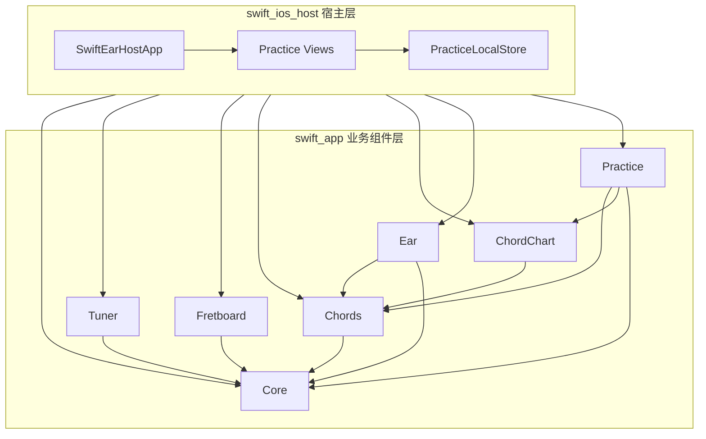
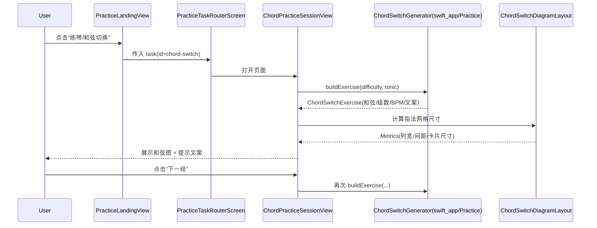
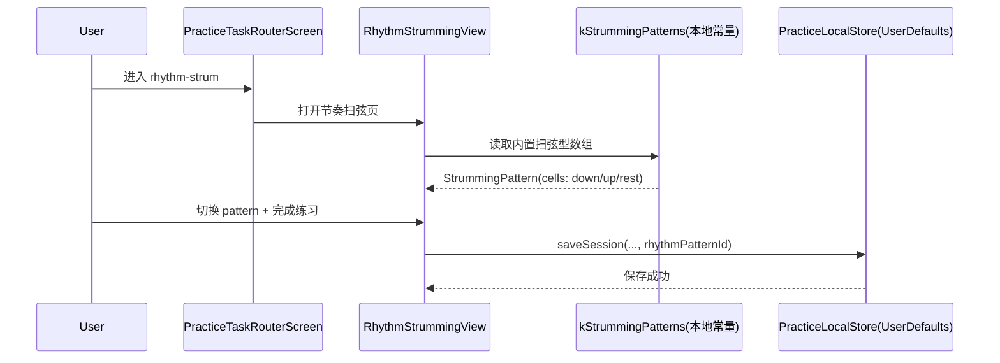

# Swift 项目架构与调用关系（学习版）

> 适用范围：`swift_app`（Swift Package 业务层）+ `swift_ios_host`（iOS 宿主层）

## 1. 一句话理解整体结构

- `swift_app`：可复用的业务能力与功能组件库（多模块 Swift Package）。
- `swift_ios_host`：iOS App 壳工程（导航、页面装配、本地存储、平台打包）。
- 关系：`swift_ios_host` 依赖 `swift_app` 提供的模块，把能力拼装成最终 App。

---

## 2. 目录与职责分层

## 2.1 `swift_app`（能力层）

- `Package.swift`：定义模块边界与依赖关系。
- `Sources/Core`：主题、基础工具、通用能力。
- `Sources/Features/*`：功能模块（如 `Practice`、`Ear`、`Chords` 等）。
- `Tests/*`：模块级测试（单元/集成/UI）。

典型职责：
- 训练生成器（例如和弦切换题目生成）。
- 业务模型与文案拼装。
- 可复用训练视图组件。

## 2.2 `swift_ios_host`（宿主层）

- `Sources/SwiftEarHostApp.swift`：App 入口、Tab 结构、全局 UI 外观。
- `Sources/Practice/Views/*`：练习域页面与路由（入口页、任务页、详情页）。
- `Sources/Practice/Models/*`：宿主侧模型（如扫弦 pattern 列表）。
- `Sources/Practice/Store/*`：本地持久化（当前是 `UserDefaults`）。
- `project.yml` + `SwiftEarHost.xcodeproj`：iOS 构建配置与依赖装配。

典型职责：
- 决定“从哪个入口进到哪个页面”。
- 组织交互流程（sheet、导航、完成/保存逻辑）。
- 绑定本地存储与练习记录展示。

---

## 3. 模块依赖图（核心）

说明：
- `swift_ios_host` 是组装层，直接依赖 `swift_app` 的多个产品模块。
- `swift_app` 内部也有层次依赖（如 `Practice -> Chords/ChordChart`）。

---

## 4. 练习域关键调用关系

## 4.1 从 App 到“练习”入口

1. `SwiftEarHostApp` 创建 `RootTabView`。
2. Tab 切到“练习”后进入 `PracticeHomeView`（别名映射到 `PracticeLandingView`）。
3. `PracticeLandingView` 展示“今日推荐训练”和“快速开始”。
4. “练琴”入口进入 `GuitarPracticeHubScreen`，再根据任务 id 路由到具体页面。

## 4.2 任务路由规则

`PracticeTaskRouterScreen` 当前映射：
- `chord-switch` -> `ChordPracticeSessionView`
- `rhythm-strum` -> `RhythmStrummingView`
- `scale-walk` -> `PracticeTimerSessionView`

---

## 5. 两条典型时序图

## 5.1 和弦切换（`chord-switch`）

关键点：
- 出题逻辑在 `swift_app`（可复用）。
- 页面交互在 `swift_ios_host`（宿主控制）。

## 5.2 节奏扫弦（`rhythm-strum`）

关键点：
- 扫弦 pattern 数据当前来自本地 `StrummingPattern.swift` 常量，不是远端下发。

---

## 6. 数据流与状态管理（Practice 域）

- 会话记录统一经 `PracticeSessionStore` 抽象。
- 当前默认实现 `PracticeLocalStore`，保存到 `UserDefaults`：
  - `loadSessions()`
  - `saveSession(...)`
  - `loadSummary(now:)`
- 练习首页 ViewModel（`PracticeLandingViewModel`）启动时：
  1. 读本地 sessions。
  2. 与推荐历史合并。
  3. 交给 `TodayRecommendationPlanner` 生成今日推荐列表。

---

## 7. 为什么要拆成 `swift_app` + `swift_ios_host`

- 业务能力可复用：训练逻辑、模型、主题不绑死在单个 App 工程里。
- 边界清晰：算法/生成器放 package，路由/交互/存储放宿主。
- 测试更快：package 层可直接跑模块测试，宿主层做集成验证。
- 演进更稳：后续做 iPad/macOS 或新宿主时，复用 `swift_app` 成本低。

---

## 8. 学习建议（从易到难）

1. 先读 `swift_ios_host/Sources/SwiftEarHostApp.swift`，理解入口与 Tab 结构。
2. 再读 `PracticeLandingView.swift`，理解练习入口与任务路由。
3. 跟一条链路（推荐先 `rhythm-strum`）看到 `StrummingPattern.swift` 与 `PracticeLocalStore.swift`。
4. 最后读 `swift_app/Sources/Features/Practice/ChordSwitchGenerator.swift`，理解业务生成逻辑如何被宿主消费。

> 你如果愿意，我可以在这个文档后续再补一版“按文件逐行导读清单（学习顺序 + 看点）”。
